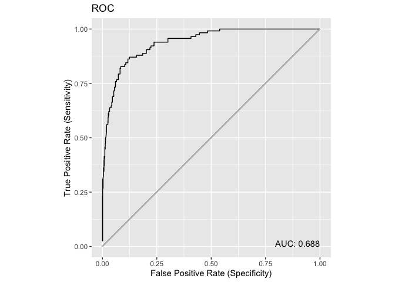

presence
================

This package provides tools for working with models prodcued using
presence-only data such as [maxnet](https://github.com/mrmaxent/maxnet),
maxent and others.

## Generate a dataset

We’ll use [maxnet](https://github.com/mrmaxent/maxnet) to generate data.

``` r
suppressPackageStartupMessages({
  library(dplyr)
  library(maxnet)
  library(presence)
})

obs <- dplyr::as_tibble(maxnet::bradypus)

mod <- maxnet(obs$presence, dplyr::select(obs, -presence))
pred <- predict(mod, newdata = bradypus, na.rm = TRUE, type = "cloglog")

x <- dplyr::tibble(pres = obs$presence,
                   pred = pred[,1])
```

## ROC

``` r
roc <- presence::ROC(x)
plot(roc, use = "ggplot")
```

<!-- -->
